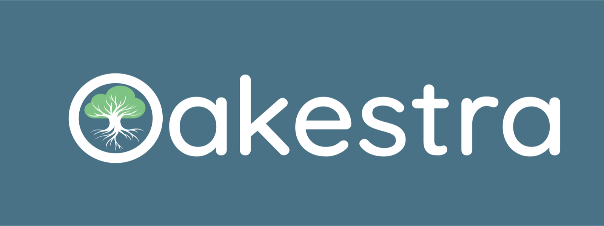

<div align="center">



### A lightweight orchestration framework for the edge-cloud continuum

[](https://www.oakestra.io/)
[](https://www.oakestra.io/docs/getting-started/welcome-to-oakestra/)
[](https://discord.gg/7F8EhYCJDf)
[](https://github.com/oakestra/oakestra/blob/main/LICENSE)
[](https://github.com/oakestra/oakestra)

</div>

---

## 🌳 What is Oakestra?

Kubernetes and K3s were built for reliable, low latency, high bandwidth datacenters. The edge is none of those things: devices are constrained, heterogeneous, intermittently connected, and spread across administrative domains.

**Oakestra** is built from the ground up for that reality. It is a hierarchical orchestration framework that deploys and manages containerized workloads across edge and cloud infrastructure, from a single Raspberry Pi to a multi-cluster deployment spanning several sites.

- 🪶 **Lightweight** - a worker node needs ~50MB of disk and ~100MB of RAM
- 🏔️ **Hierarchical** - a root orchestrator federates independent cluster orchestrators, so clusters keep working when the root is unreachable
- 🌐 **Semantic networking** - service-to-service communication across nodes and clusters via a semantic overlay, with load balancing baked into the address
- 🧩 **Extensible** - pluggable schedulers, addons, and a Kubernetes integration
- 📦 **Multi-runtime** - containers, unikernels, and plain binaries on ARM64 and AMD64

## 🚀 Get started

```bash
# Start a root orchestrator (Docker + Docker Compose v2 required)
git clone https://github.com/oakestra/oakestra.git && cd oakestra
./scripts/StartOakestraRoot.sh
```

📚 Full walkthrough: **[Your first orchestrator](https://www.oakestra.io/docs/getting-started/oak-environment/your-first-orchestrator/)**

---

## 📦 Repositories

### Core platform

| Repository | Description |
| :--- | :--- |
| [**oakestra**](https://github.com/oakestra/oakestra) | The main framework. Root orchestrator, cluster orchestrator, and the Node Engine that runs workloads on worker nodes. Start here. |
| [**oakestra-net**](https://github.com/oakestra/oakestra-net) | The networking layer. Net Manager daemon and service managers that provide the semantic overlay connecting services across nodes and clusters. |
| [**dashboard**](https://github.com/oakestra/dashboard) | General-purpose web UI for managing applications, services, clusters, and nodes. |
| [**oakestra-cli**](https://github.com/oakestra/oakestra-cli) | `oak`, the command line interface. Self-contained Go binary for Linux, macOS, and Windows, plus the legacy Python `oak-cli` on PyPI. |


### Tooling and infrastructure

| Repository | Description |
| :--- | :--- |
| [**automation**](https://github.com/oakestra/automation) | Ansible playbooks and helper scripts for deploying and managing orchestrators and worker nodes, plus development cluster tooling. |
| [**documentation**](https://github.com/oakestra/documentation) | Source for the Oakestra website and documentation at [oakestra.io](https://www.oakestra.io/). |

### Examples and demos

| Repository | Description |
| :--- | :--- |
| [**app-minecraft-client-server-example**](https://github.com/oakestra/app-minecraft-client-server-example) | End-to-end tutorial: host and scale a Minecraft server on Oakestra and play it from the browser. A good first deployment. |
| [**app-ar-pipeline**](https://github.com/oakestra/app-ar-pipeline) | Demo augmented reality pipeline split into three microservices, showing latency-sensitive workload placement at the edge. |

<details>
<summary><b>Archived and experimental</b></summary>

<br>

| Repository | Description |
| :--- | :--- |
| [USENIX-ATC23-Oakestra-Artifacts](https://github.com/oakestra/USENIX-ATC23-Oakestra-Artifacts) | Frozen artifacts reproducing the USENIX ATC '23 paper evaluation. Archived. |
| [USENIX-ATC23-Oakestra-net-Artifacts](https://github.com/oakestra/USENIX-ATC23-Oakestra-net-Artifacts) | Networking artifacts for the same paper. Archived. |
| [oakestra-experimental](https://github.com/oakestra/oakestra-experimental) | Experimental fork used for prototyping. Not for production. |
| [notion-github-action](https://github.com/oakestra/notion-github-action) | Fork of a GitHub Action that syncs issues to a Notion database, used for internal planning. |

</details>

---

## 🤝 Contributing

Contributions are welcome, whether that is a bug report, a doc fix, a new scheduler, or a whole addon.

- 🐛 Found a bug or have an idea? Open an issue on the relevant repository
- 🔧 Ready to write code? Check the contributing guide in the repo you want to work on
- 💬 Not sure where to start? Ask in [Discord](https://discord.gg/7F8EhYCJDf), we are happy to point you at something

## 📖 Research

Oakestra started as a research project at the **Technical University of Munich** and is published at USENIX ATC '23:

> **[Oakestra: A Lightweight Hierarchical Orchestration Framework for Edge Computing](https://www.oakestra.io/pubs/Oakestra-ATC2023.pdf)**
> Giovanni Bartolomeo, Mehdi Yosofie, Simon Bäurle, Oliver Haluszczynski, Nitinder Mohan, Jörg Ott
> *2023 USENIX Annual Technical Conference (USENIX ATC '23)*

More publications and follow-up work: [oakestra.io/research](https://www.oakestra.io/research/)

---

<div align="center">

**[Website](https://www.oakestra.io/)** · **[Documentation](https://www.oakestra.io/docs/getting-started/welcome-to-oakestra/)** · **[Blog](https://www.oakestra.io/blog/)** · **[Discord](https://discord.gg/7F8EhYCJDf)** · **[X](https://x.com/oakestra)** · **[YouTube](https://www.youtube.com/@oakestra)**

Licensed under [Apache 2.0](https://github.com/oakestra/oakestra/blob/main/LICENSE)

</div>
